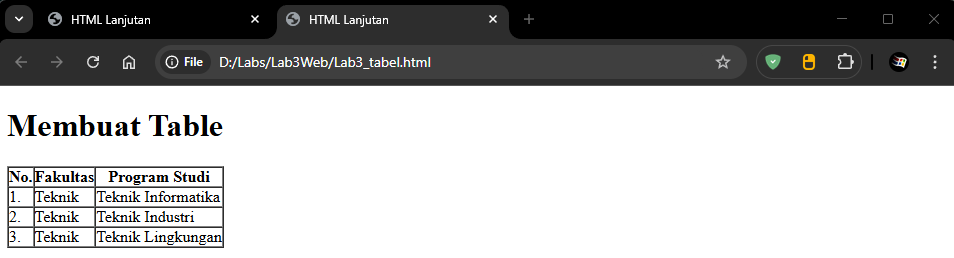

# Lab3Web

- Nama : Roufan Awaluna Romadhon
- NIM : 31240423
- Kelas : TI.24.A.3

---

## Deskripsi

Tugas ini untuk membuat sebuah list, tabel dan form di html

## Langkah-langkah

Persiapan membuat dokumen HTML dengan nama file lab3_list.html seperti berikut.

```html
<!DOCTYPE html>
<html lang="en">
<head>
    <meta charset="UTF-8">
    <meta name="viewport" content="width=device-width, initial-scale=1.0">
    <title>HTML Lanjutan</title>
</head>
<body>
    <header>
    <h1>Membuat List</h1>
     </header>
</body>
</html>
```

### Membuat Ordered List
kemudian tambahkan kode untuk membuat ordered list seperti berikut.

```html
<section id="order-list">
     <h2>Ordered List</h2>
     <ol>
         <li>Pemrograman Web</li>
         <li>Sistem Informasi</li>
         <li>Basis Data 2</li>
     </ol>
</section>
```

Screenshot


### Membuat Unorderd List

Kemudian tambakan kode untuk membuat Unordered List, setelah deklarasi ordered list pada section unordered-list, seperti berikut.

```html
<section id="unorder-list">
    <h2>Unordered List</h2>
    <ul type="square">
        <li>Jaringan Komputer</li>
        <li>Struktur Data</li>
        <li>Algoritma &amp; Pemrograman</li>
    </ul>
</section>
```

Screenshot


### Membuat Description List

Kemudian tambahkan kode untuk membuat description list setelah deklarasi unorderd-list.

```html
<section id="unorder-list">
    <h2>Description List</h2>
    <dl>
        <dt>Fakultas Teknik</dt>
        <dd>Teknik Industri</dd>
        <dd>Teknik Informatika</dd>
        <dd>Teknik Lingkungan</dd>
        <dt>Fakultas Ekonomi dan Bisnis</dt>
        <dd>Akuntansi</dd>
        <dd>Manajemen</dd>
        <dd>Bisnis Digital</dd>
    </dl>
</section>
```

Screenshot


### Membuat Tabel

Buat file baru dengan nama lab3_tabel.html seperti berikut.

```html
<!DOCTYPE html>
<html lang="en">
<head>
    <meta charset="UTF-8">
    <meta name="viewport" content="width=device-width, initial-scale=1.0">
    <title>HTML Lanjutan</title>
</head>
<body>
    <header>
        <h1>Membuat Table</h1>
    </header>
</body>
</html>
```

Kemudian selanjutnya tambahkan kode untuk membuat tabel sederhana seperti berikut:

```html
<table border="1" cellpadding="0" cellspacing="0">
    <thead>
        <tr>
            <th>No.</th>
             <th>Fakultas</th>
            <th>Program Studi</th>
         </tr>
    </thead>
    <tbody>
         <tr>
            <td>1.</td>
            <td>Teknik</td>
            <td>Teknik Informatika</td>
        </tr>
        <tr>
            <td>2.</td>
            <td>Teknik</td>
            <td>Teknik Industri</td>
        </tr>
        <tr>
            <td>3.</td>
            <td>Teknik</td>
            <td>Teknik Lingkungan</td>
        </tr>
    </tbody>
</table>
```

Screenshot


### Mengatur Margin dan Padding

Untuk mengatur margin dan padding pada cel data, tambahkan atribut cellpadding dan cellspacing pada tag table.

```html
<table border="1" cellpadding="4" cellspacing="0">
```

Screenshot


### Menggabungkan Sel Data

Untuk menggabungkan sel data, gunakan atribut rowspan dan colspan. Atribut rowspan untuk menggabungkan baris (secara vertikal) dan colspan untuk menggabungkan kolom (secara horizontal).

```html
<table border="1" cellpadding="6" cellspacing="0">
    <thead>
        <tr>
            <th>No.</th>
            <th>Fakultas</th>
            <th>Program Studi</th>
        </tr>
    </thead>
    <tbody>
        <tr>
            <td>1.</td>
             <td rowspan="3">Teknik</td>
            <td>Teknik Informatika</td>
        </tr>
        <tr>
            <td>2.</td>
            <td>Teknik Industri</td>
        </tr>
        <tr>
            <td>3.</td>>
            <td>Teknik Lingkungan</td>
        </tr>
    </tbody>
</table>
```

Screenshot


### Membuat Form

Buat file baru dengan nama lab3_form.html seperti berikut.

```html
<!DOCTYPE html>
<html lang="en">
    <head>
    <meta charset="UTF-8">
    <meta name="viewport" content="width=device-width, initial-scale=1.0">
    <title>HTML Lanjutan</title>
</head>
<body>
    <header>
        <h1>Membuat Form</h1>
    </header>
</body>
</html>
```

Kemudian selanjutnya tambahkan kode untuk membuat tabel sederhana seperti berikut:

```html
<form action="proses.php" method="post">
    <fieldset>
        <legend>Data Pelanggan</legend>
        <p>
            <label for="nama">Nama</label>
            <input type="text" id="nama" name="nama">
        </p>
        <p>
            <label for="alamat">Alamat</label>
            <textarea id="alamat" name="alamat" cols="20" rows="3"></textarea>
        </p>
        <p>
            <label>Jenis Kelamin</label>
            <input id="jk_1" type="radio" name="kelamin" value="L" />
            <label for="jk_1">Laki-laki</label>
            <input id="jk_p" type="radio" name="kelamin" value="P" />
            <label for="jk_p">Perempuan</label>
        </p>
        <p><input type="submit" value="Login"></p>
    <fieldset>
</form>
```

Screenshot


### Menambahkan Style pada Form

Agar tampilan form lebih menarik, bisa ditambahkan CSS seperti berikut.

```html
<style>
    form p > label {
        display: inline-block;
        width: 100px;
    }
    form input[type="text"], form textarea, form select {
        border: 1px solid #197a43;
        padding: 4px;
    }
    form input[type="submit"] {
        border: 1px solid #197a43;
        background-color: #197a43;
        color: #ffffff;
        font-weight: bold;
        padding: 5px 10px;
    }
</style>
```

Screenshot


## Pertanyaan dan Tugas

### 1. Buatlah form yang menampilkan dropdown menu dan listbox dengan multiple selection

Buat file baru dengan nama Tugas.Lab3.html seperti berikut.

```html
<!DOCTYPE html>
<html lang="en">
    <head>
    <meta charset="UTF-8">
    <meta name="viewport" content="width=device-width, initial-scale=1.0">
    <title>Tugas HTML</title>
</head>
<body>
    <header>
        <h1>Selamat Datang</h1>
    </header>
</body>
</html>
```

Kemudian selanjutnya tambahkan kode untuk membuat tabel sederhana seperti berikut:

```html
<form>
    <fieldset>
    <legend>Data Pelanggan</legend>
    <p>
        <label for="nama">Nama</label>
        <input type="text" id="nama" name="nama">
    </p>
    <p>
        <label for="alamat">Alamat</label>
        <textarea id="alamat" name="alamat" cols="20" rows="3"></textarea>
    </p>
    <p>
        <label for="kota">Kota</label>
        <select id="kota" name="kota">
            <option value="">-- Pilih Kota --</option>
            <option value="jakarta">Jakarta</option>
            <option value="bandung">Bandung</option>
            <option value="surabaya">Surabaya</option>
            <option value="yogyakarta">Yogyakarta</option>
            <option value="medan">Medan</option>
        </select>
    </p>
    <p>
        <label>Jenis Kelamin</label>
        <input id="jk_1" type="radio" name="kelamin" value="L" />
        <label for="jk_1">Laki-laki</label>
        <input id="jk_p" type="radio" name="kelamin" value="P" />
        <label for="jk_p">Perempuan</label>
    </p>
    <p>
        <label for="hobi">Hobi</label>
        <select id="hobi" name="hobi" multiple>
            <option value="membaca">Membaca</option>
            <option value="olahraga">Olahraga</option>
            <option value="musik">Musik</option>
            <option value="traveling">Traveling</option>
            <option value="game">Game</option>
        </select>
    </p>
    <p><input type="submit" value="Login"></p>
</fieldset>
</form>
```

Screenshot


Agar tampilan form lebih menarik, bisa ditambahkan CSS seperti berikut.

```html
<style>
    form p > label {
        display: inline-block;
        width: 100px;
    }
    form input[type="text"], form textarea, form select {
        border: 1px solid #197a43;
        padding: 4px;
    }
    form input[type="submit"] {
        border: 1px solid #197a43;
        background-color: #197a43;
        color: #ffffff;
        font-weight: bold;
        padding: 5px 10px;
        cursor: pointer;
    }
    form select[multiple] {
        width: 150px;
        height: 80px;
    }
</style>
```

Berikut Hasilnya.

Screenshot

